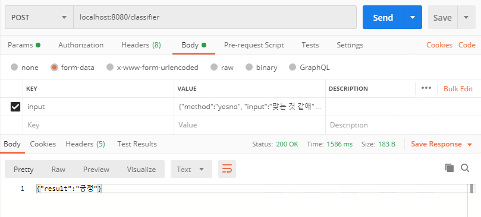

# D2EClassifier
Speech classifier of D2E AI block

## Requirements
- This project support the [InteliJ IDEA](https://www.jetbrains.com/idea/)
- Java JDK > 8

## Run
- On Ubuntu or Mac

`./gradlew bootRun`

- On Windows

`./gradlew.bat bootRun`

## Example

### yesno
`{"method":"yesno", "input":"맞는 것 같애"}`

### movements
`{"method":"movements", "input":"오른팔을 위로 올려봐"}`

### picknum
`{"method":"picknum", "input":"사십칠이야"}`

### choice
`{"method":"choice", "input":{"choice": ["오타와","토론토","몬트리올","밴쿠버","서울"], "answer": "정답은 오타와 인 것 같아"}}`

## RestAPI test using the [Postman](https://www.postman.com)

- Method POST
- [Url] localhost:8080/classifier

